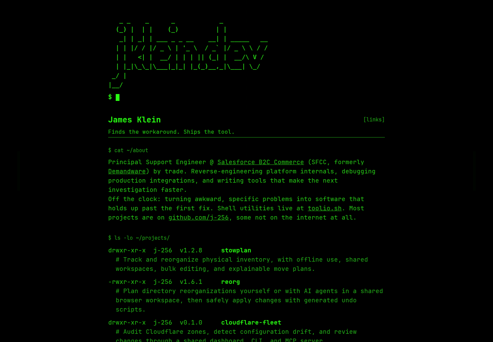

# site

```
   _ _    _      _            _
  (_) |  | |    (_)          | |
   _| | _| | ___ _ _ __    __| | _____   __
  | | |/ / |/ _ \ | '_ \  / _` |/ _ \ \ / /
  | |   <| |  __/ | | | || (_| |  __/\ V /
  | |_|\_\_|\___|_|_| |_(_)__,_|\___| \_/
 _/ |
|__/
```

Source for [jklein.dev](https://jklein.dev/).



## Stack

- [Astro](https://astro.build/) (static)
- TypeScript (strict)
- Vanilla CSS, [JetBrains Mono](https://www.jetbrains.com/lp/mono/) (self-hosted, OFL)
- Cloudflare Workers Static Assets with a custom domain
- GitHub Actions for verification and direct deployment

## Setup

The hostname comes from a single `SITE_HOST` environment variable, used everywhere the deployed domain appears (canonical link, OG meta, JSON-LD, sitemap, robots.txt, the generated `public/CNAME`). The build fails loud if it's unset.

```bash
cp .env.example .env       # contains SITE_HOST=jklein.dev
nvm use                    # picks up .nvmrc
npm install
```

## Develop

```bash
npm run dev                # http://localhost:4321 (also writes public/CNAME)
npm test                   # vitest plus the required documentation cover
npm run typecheck          # astro check
npm run build              # write CNAME, fetch project data, then astro build
npm run refresh-project-cache # refresh the committed project fallback
npm run capture:cover      # build locally and refresh the documentation cover
npm run deploy:dry-run     # validate the current dist artifact with Wrangler
```

Install the matching browser with `npx playwright install chromium` before using the cover command. It renders the candidate production build locally at 1440x1000 with dark colors and reduced motion, then replaces `docs/screenshots/cover.png`; it does not capture or deploy the live site.

## Pong

The low-contrast background court rests behind the page without a ball. Sustained mouse movement for 1.2 seconds spawns the ball and starts play with both paddles on the ball's subdued background layer; brief or interrupted movement leaves the court dormant. `P` skips that discovery delay and reveals the game paused; Escape skips it and starts play immediately. On a touchscreen, placing one thumb on each half of the viewport starts or resumes play immediately, with one thumb controlling each paddle. Lifting either thumb pauses the game. Pong claims scrolling and pinch gestures only while that two-thumb control is active, so ordinary one-finger browsing never activates or controls it. The ball disappears completely behind foreground text until a player returns it with a paddle. Each of the first four paddle returns permanently raises the foreground brightness of the ball and both paddles through 20%, 40%, 60%, and 80% opacity; later returns remain at the final stage. The first return also types the score into the boot prompt, and every impact briefly emphasizes the ball above its settled brightness. Each paddle return slightly accelerates the ball for the rest of the rally, up to a cap, and each goal resets the next serve to its base speed. The brightness stage persists across later points, pause and resume, inactivity sleep and wake, and Escape dismissal and restoration. The prompt clears and retypes the score after each goal. Mouse movement controls the paddle on its half of the viewport, `W` and `S` control the left paddle, and Arrow Up and Arrow Down control the right paddle. `P` freezes or resumes the ball and paddles. Escape hides the game; a second Escape restores whether it was running or paused. After eight seconds without player input, the game sleeps behind the dormant court; the next mouse movement, two-thumb touch, or Escape restores it. Other game input is ignored while it is hidden. Foreground links, text selection, and scrolling remain the primary interface.

A present `animate` query parameter forces both the boot transcript and Pong to animate despite a reduced-motion preference, including bare `?animate`, `?animate=1`, and `?animate=true`. `?animate=0` or `?animate=false` forces both animations off. Only an absent parameter defers to the system preference. With system motion reduction active, the dormant court stays static until Escape opts the loaded page into motion and starts Pong immediately; `P` then pauses or resumes normal play. Escape does not override the explicit disable query values. The override is entirely client-side and the deployment remains static.

## Deployment

GitHub Actions owns the production pipeline. Every push to `main`, weekly refresh, and manual workflow run installs the locked dependencies, runs the tests, builds once, and deploys that exact `dist` directory to the `site` Cloudflare Worker through Wrangler. Pull requests perform the same verification without deploying. The deploy step receives `CLOUDFLARE_API_TOKEN` and `CLOUDFLARE_ACCOUNT_ID` from repository Actions secrets; `wrangler.jsonc` contains only non-secret deployment configuration.

`npm run deploy` publishes the existing `dist` directory and assumes it has already been verified. Use `npm run deploy:dry-run` to validate the artifact and configuration without publishing.

## Hostname change procedure

1. Update `.env` locally.
2. Update the GitHub repo Variable: `gh variable set SITE_HOST --body 'newhost.example' --repo j-256/site`
3. Update the Worker's custom domain and its DNS record in Cloudflare.
4. Push. GitHub Actions rebuilds with the new value and deploys the verified artifact.

## Projects

`src/data/projects.ts` is the site's ordered list and contains only site-specific display choices. At build time, `scripts/fetch-projects.ts` verifies each repository is public and active, derives its name, owner, description, URL, and default-branch revision from GitHub, then fetches `docs/screenshots/cover.png` at that exact revision. Missing, malformed, oversized, or unverifiable covers fail the build. Local fetches use `GITHUB_TOKEN`, then `GH_TOKEN`, then the authenticated GitHub CLI session; without a credential, requests remain anonymous and are subject to GitHub's lower rate limit.

The terminal project rows remain the primary interface. On fine-pointer devices, dwelling on the compact entry line fills a progress bar before opening a non-interactive terminal-framed cover preview. The description and padded click target do not trigger it, pointer focus does not pin it open, and Escape hides it. Keyboard focus uses the same dwell; touch layouts retain the terminal list without a preview.

Routine development and builds write fetched display data to the ignored `src/data/project-data.runtime.json`, so starting the site does not modify tracked files. `src/data/project-data.cache.json` is the committed fallback snapshot used when runtime data is unavailable. Whichever data file is loaded supplies fallback values when an individual metadata lookup fails. Run `npm run refresh-project-cache` when a verified result should replace the committed snapshot. Neither data file can make a repository or cover publishable: visibility and the revision-bound cover are verified on every fetch. Generated project images live under the ignored `public/project-assets/`. Set `PROJECT_REPOSITORY_ROOT` to a directory of local Git checkouts to read each committed cover locally while still verifying repository state and display metadata with GitHub.

## License

[MIT](LICENSE).
